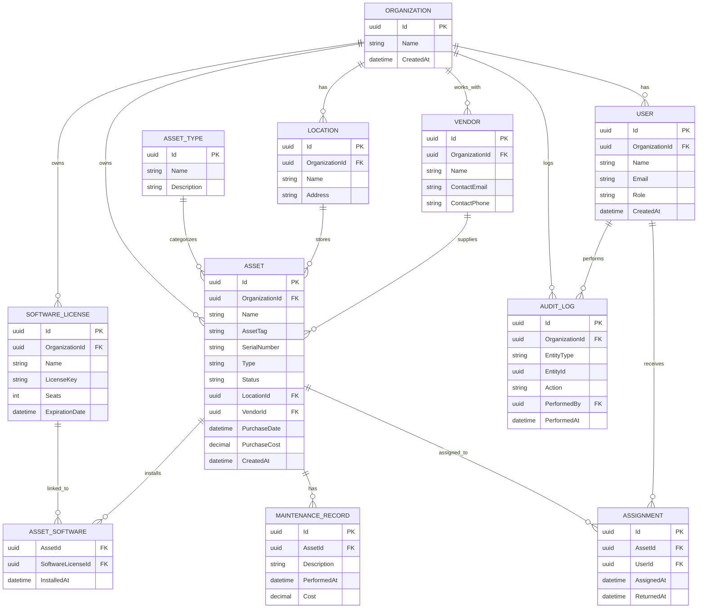

```mermaid
erDiagram

    ORGANIZATION {
        uuid Id PK
        string Name
        datetime CreatedAt
    }

    USER {
        uuid Id PK
        uuid OrganizationId FK
        string Name
        string Email
        string Role
        datetime CreatedAt
    }

    ASSET {
        uuid Id PK
        uuid OrganizationId FK
        string Name
        string AssetTag
        string SerialNumber
        string Type
        string Status
        uuid LocationId FK
        uuid VendorId FK
        datetime PurchaseDate
        decimal PurchaseCost
        datetime CreatedAt
    }

    ASSET_TYPE {
        uuid Id PK
        string Name
        string Description
    }

    LOCATION {
        uuid Id PK
        uuid OrganizationId FK
        string Name
        string Address
    }

    VENDOR {
        uuid Id PK
        uuid OrganizationId FK
        string Name
        string ContactEmail
        string ContactPhone
    }

    ASSIGNMENT {
        uuid Id PK
        uuid AssetId FK
        uuid UserId FK
        datetime AssignedAt
        datetime ReturnedAt
    }

    MAINTENANCE_RECORD {
        uuid Id PK
        uuid AssetId FK
        string Description
        datetime PerformedAt
        decimal Cost
    }

    SOFTWARE_LICENSE {
        uuid Id PK
        uuid OrganizationId FK
        string Name
        string LicenseKey
        int Seats
        datetime ExpirationDate
    }

    ASSET_SOFTWARE {
        uuid AssetId FK
        uuid SoftwareLicenseId FK
        datetime InstalledAt
    }

    AUDIT_LOG {
        uuid Id PK
        uuid OrganizationId FK
        string EntityType
        uuid EntityId
        string Action
        uuid PerformedBy FK
        datetime PerformedAt
    }

    %% Relationships

    ORGANIZATION ||--o{ USER : has
    ORGANIZATION ||--o{ ASSET : owns
    ORGANIZATION ||--o{ LOCATION : has
    ORGANIZATION ||--o{ VENDOR : works_with
    ORGANIZATION ||--o{ SOFTWARE_LICENSE : owns
    ORGANIZATION ||--o{ AUDIT_LOG : logs

    ASSET_TYPE ||--o{ ASSET : categorizes

    LOCATION ||--o{ ASSET : stores
    VENDOR ||--o{ ASSET : supplies

    ASSET ||--o{ ASSIGNMENT : assigned_to
    USER ||--o{ ASSIGNMENT : receives

    ASSET ||--o{ MAINTENANCE_RECORD : has

    SOFTWARE_LICENSE ||--o{ ASSET_SOFTWARE : linked_to
    ASSET ||--o{ ASSET_SOFTWARE : installs

    USER ||--o{ AUDIT_LOG : performs
```

