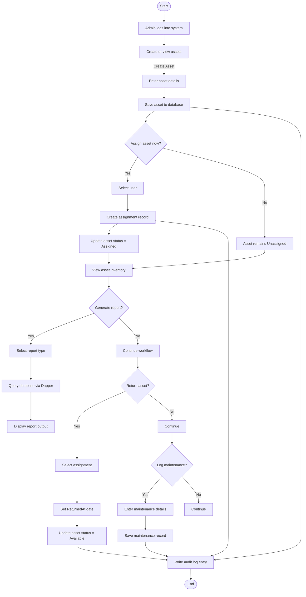

```mermaid 
flowchart TD

    Start([Start])

    %% Asset Creation
    Start --> A[Admin logs into system]
    A --> B[Create or view assets]

    B -->|Create Asset| C[Enter asset details]
    C --> D[Save asset to database]

    D --> E{Assign asset now?}

    %% Assignment Flow
    E -->|Yes| F[Select user]
    F --> G[Create assignment record]
    G --> H[Update asset status = Assigned]

    E -->|No| I[Asset remains Unassigned]

    %% Viewing / Reporting
    H --> J[View asset inventory]
    I --> J

    J --> K{Generate report?}

    K -->|Yes| L[Select report type]
    L --> M[Query database via Dapper]
    M --> N[Display report output]

    K -->|No| O[Continue workflow]

    %% Return Flow
    O --> P{Return asset?}
    P -->|Yes| Q[Select assignment]
    Q --> R[Set ReturnedAt date]
    R --> S[Update asset status = Available]

    P -->|No| T[Continue]

    %% Maintenance Flow
    T --> U{Log maintenance?}
    U -->|Yes| V[Enter maintenance details]
    V --> W[Save maintenance record]

    U -->|No| X[Continue]

    %% Audit Logging
    W --> Y[Write audit log entry]
    S --> Y
    G --> Y
    D --> Y

    Y --> End([End])
```

